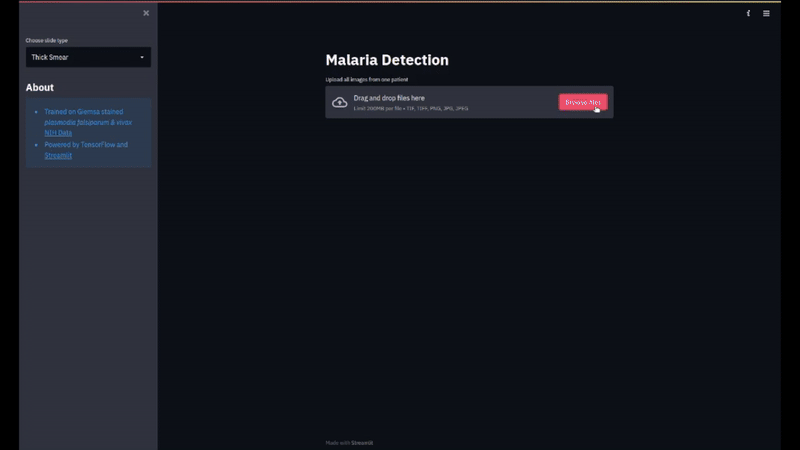

# Malaria Detection  

This project is a proof of concept, where images can be uploaded and analysed for Malaria. The model can distinguish between plasmodium falciparum and vivax. We use [NIH images](https://lhncbc.nlm.nih.gov/LHC-downloads/downloads.html#malaria-datasets) to train our model. 


## Demo

  

## Start-up instructions
Run the docker file from a laptop/ computer (GPU-enhanced will make the model run faster). First build the dockerfile from within the malatec_app/docker folder:

```bash
docker build -t malariadetection_webapp .
```
Now you can run the docker file, which starts up the streamlit app:

```bash
docker run -it --rm --name malariadetection_webapp -v /home/fight/Documents/malariadetection_webapp/docker:docker  malariadetection_webapp:latest
```
Follow the link provided in the console and you should be able to see the streamlit app.
 
**Pipeline**    

- Powered by Tensorflow and [Streamlit](https://docs.streamlit.io/en/stable/api.html)  

**[Publicly Available Malria Datasets](https://github.com/danielbarco/malaria_datasets)**

**Run Cloudflare Tunnel**

To access the cloudflare tunnel at demo.malariadetection.ch run. This requires some additional setup.

```bash
cloudflared tunnel run
```

**Run DGX**

```bash
docker run -it --runtime=nvidia --memory="16g" --memory-swap=-1 --oom-kill-disable --rm --name dualx -v /cluster/home/baoc/dualx/detect_malaria:/workspace/detect_malaria -v /cluster/home/baoc/dualx/malariadetection_webapp:/workspace/malariadetection_webapp -v /cluster/home/baoc/data/malaria:/workspace/data/ -p 8970:8501 malariadetection_webapp:latest
```

```bash
streamlit run /workspace/malariadetection_webapp/docker/app.py  --server.fileWatcherType none --server.address 0.0.0.0
```


Made with ❤️ in Switzerland ⛰️

