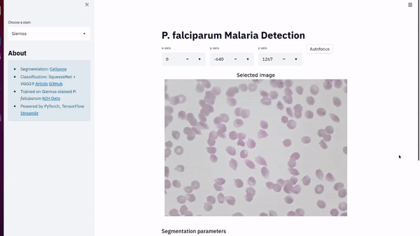

# Malaria Detection  

This project is a proof of concept, where we use a 3D printed [Openflexure microscope](https://openflexure.org/) to take pictures and then detect malaria. We use [NIH images](https://lhncbc.nlm.nih.gov/LHC-downloads/downloads.html#malaria-datasets) to train our model. 

The app also functions without an openflexure microscope just by uploading images.

## Demo

  

## Start-up instructions
Run the docker file from a laptop/ computer while the Openflexure microscope is up and running. First build the dockerfile from within the malatec_app/docker folder:

```bash
docker build -t malatec_app .
```
Now you can run the docker file, which starts up the streamlit app:

```bash
docker run -it --rm --name malatec_app -v /home/fight/Documents/malatec_app/docker  malatec_app:latest
```
Follow the link provided in the console and you should be able to see the streamlit app.

**Pipeline**    

- Cell segmentation from microscope images using [cellpose](https://github.com/MouseLand/cellpose)  
- Classification: SqueezeNet + VGG19 [Article](https://peerj.com/articles/6977.pdf) [GitHub](https://github.com/sivaramakrishnan-rajaraman/Deep-Neural-Ensembles-toward-Malaria-Parasite-Detection-in-Thin-Blood-Smear-Images)
- Powered by PyTorch, Tensorflow and [Streamlit](https://docs.streamlit.io/en/stable/api.html)  

Made with ❤️ in Switzerland ⛰️
  
